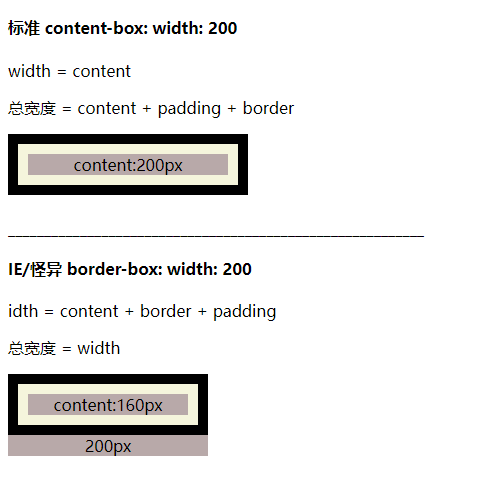
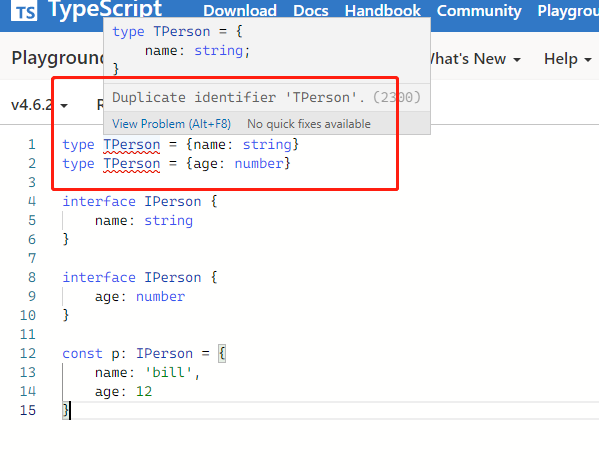

1. 重绘，重排 √
2. 性能优化 √
3. 盒模型 √
4. react useMemo useCallback √
5. react 性能优化 √
6. react 生命周期 √
7. react 有状态组件 无状态组建区别 √
8. react 受控组件 非受控组件 √
9. electron 通信异步 同步 √
10. 闭包，实际应用有哪些 √
11. type 与 interface 的区别 √
12. call apply bind √

# 重绘repaint 重排reflow

1. HTML被解析成DOM树
2. CSS被解析成CSSOM树
3. 结合DOM树和CSSOM树，生成一棵渲染树（Render Tree），这一过程成文Attachment
4. 生成布局flow,浏览器在屏幕上画出渲染树的所有节点
5. 将布局绘制paint在屏幕上，显示出整个页面

其中4，5是最耗时的部分。

> 不管页面发生了重绘还是重排，都会影响性能，最可怕的是重排，会使我们付出高额的性能代价，所以我们应尽量避免。

- 重绘：某元素的外观发生改变，如填充色；重绘不一定重排，
- 重排：重新生成布局，重新排列元素；重排一定会重绘

### 重排reflow
以下情况会发生重排：
- 页面初次渲染
- 增加/删除可见DOM元素
- 改变元素位置
- 改变尺寸
- 改变元素字体大小
- 改变浏览器窗口尺寸
- css伪类
- 设置style属性，因为通过设置style属性改变节点样式，每次设置都会触发一次reflow;
- 查询某些属性胡哦调用计算方法：`offsetWidth`,`offsetHeight`, ...

### 重绘repaint
当一个元素的外观发生改变，但是没有改变布局

- color
- border-style
- visbility
- background
- ...


[重排(reflow)和重绘(repaint)](https://juejin.cn/post/6844904083212468238)


# 2. 性能优化

### 2.1 HTTP 相关优化
- ETag 标记缓存，修改标记
- Last-modified 根据修改时间
- Expires & Max-age 强制缓存：约定一个最大存活时间，这个时间内不再访问服务器


### 2.2 资源相关优化
- 小图转base64
- 多图合并雪碧图
- 大图无损压缩
- **代码压缩：webpack:mini-css-extract-plugin,uglifyjs-webpack-plugin, nginx:gzip压缩**

### 2.2 异步优化
- vue 异步组件：`AsComponent = () => import('component')`
- ract 异步组件： 
  ```
    const {  lazy, Suspense } = react
    const LzComp = lazy(import('./component'))
  ```

### 2.3 js优化
- 减少DOM 操作，如果是Jquery,用事件代理的方式
- **达夫设备**：减少循环次数(一次循环中多次操作，以减少循环次数)
- 多调价你判断:尽量使用`switch...case`

### 2.4 css优化
- 背景能用css实现，尽量不用图片


### 2.5 HTML
- lazy: ``根据网络环境，初次加载的图片数不同

### 2.4 webpack优化
- 提取公共模块： `CommonsChunkPlugin`
  ```
  new CommonsChunkPlugin({
    // 从哪些 Chunk 中提取
    chunks: ['a', 'b'],
    // 提取出的公共部分形成一个新的 Chunk，这个新 Chunk 的名称
    name: 'common'
  })
  ```
- 避免非必要的访问全局，如果需要访问先在函数中缓存这个全局变量，如`document`
- 合理使用缓存数据:`sessionStorage`,`localStorage`
- 

# 3. 盒模型



# 4. react useMemo useCallback
- useMemo: 缓存变量
- useCallback：缓存函数


# 5. react 性能优化
## PureComponent
1. 子组件集成PureComponent，避免父组件更新，子组件渲染。
PureComponent内部自动执行了`shouldComponentUpdate`判断，避免子组件渲染
```
class Son extends PureComponent {
  constructor(props) {
    super(props);
  }
  render() {
    console.log("子组件重新渲染了！！");
    return <div className="son">子组件</div>;
  }
}

```

2. 使用 children 将无状态组件传入

我们将有状态组件和无状态组件进行分离，使用 children 将无状态组件传入。

直接在状态组件中使用children直接渲染子组件可以避免在状态组件中React使用React.createElement(Son) 渲染子组件！！这样也可以做到优化！
```
<Parent>
  <Son />
</Parent>

class Parent extends Component {
    // ... 
  render() {
    const { children } = this.props;
    return (
      <div className="parent">
        {children}
      </div>
    );
  }
}

```


## React.Memo 包裹子组件
```
const MemoSon = memo(() => <Son></Son>);

class Parent extends Component {
    // ... 
  render() {
    const { children } = this.props;
    return (
      <div className="parent">
        <MemoSon />
      </div>
    );
  }
}

```

## useMemo useCallback 细粒度的优化

- useMemo: 缓存变量
- useCallback：缓存函数

# 6. react 生命周期

1. 初始化Initialization: setup props and state

    发生在 constructor 中的内容，在 constructor 中进行 state、props 的初始化，在这个阶段修改 state，不会执行更新阶段的生命周期，可以直接对 state 赋值。

2. 挂载Mounting: 
    
    componentWillMount -> render -> compoenntDidMount
    
    - componentWillMount： 发生在 render 函数之前，还没有挂载 Dom
    - render
    - compoenntDidMount: 发生在 render 函数之后，已经挂载 Dom


3. 更新Updating: 

  - props: componentWillReceiveProps -> shouldComponentUpdate -> componentWillUpdate -> render -> componentDidUpdate


  - state: shouldComponentUpdate -> componentWillUpdate -> render -> componentDidUpdate


4.  卸载Unmounting: componentWillUnmount

> React 16 中删除了如下三个生命周期。
componentWillMount
componentWillReceiveProps
componentWillUpdate

# 7. react 有状态 无状态组件

通常来说，使用`class`关键字创建的组件，有自己的私有数据`this.state`和生命周期函数的组件就是**有状态组件Stateful Component**

而只有`props`没有自己的私有数据和生命周期的组件就是**无状态组件Stateless Component**

### 无状态组件Stateless Component
是最基础的组件形式，由于没有状态的影响所以就是纯静态展示的作用。

### 有状态组件Stateful Component
是无状态组件的基础上，如果组件内部包含`state`且状态随时间或者外部消息而发生改变的时候，这就是构成了有状态组件。

# 8. react 非受控 受控组件

**受控组件：** 组件表单维护自己的state,并且react控制表单的输入操作

在 HTML 中，表单元素（如`<input>`、 `<textarea>` 和 `<select>`）**通常自己维护 state**，并根据用户输入进行更新。而在 React 中，可变状态（mutable state）通常保存在组件的 state 属性中，并且只能通过使用 setState()来更新。

我们可以把两者结合起来，使 React 的 state 成为“唯一数据源”。**渲染表单的 React 组件还控制着用户输入过程中表单发生的操作。被 React 以这种方式控制取值的表单输入元素就叫做“受控组件”**。

```
class NameForm extends React.Component {
  constructor(props) {
    super(props);
    this.state = {value: ''};

    this.handleChange = this.handleChange.bind(this);
    this.handleSubmit = this.handleSubmit.bind(this);
  }

  handleChange(event) {
    this.setState({value: event.target.value});
  }

  handleSubmit(event) {
    alert('提交的名字: ' + this.state.value);
    event.preventDefault();
  }

  render() {
    return (
      <form onSubmit={this.handleSubmit}>
        <label>
          名字:
          <input type="text" value={this.state.value} onChange={this.handleChange} />
        </label>
        <input type="submit" value="提交" />
      </form>
    );
  }
}
```

**非受控组件：** 获取表单数据使用ref从DOM节点获取数据

要编写一个非受控组件，而不是为每个状态更新都编写数据处理函数，你可以 使用 ref 来从 DOM 节点中获取表单数据。

```
class NameForm extends React.Component {
  constructor(props) {
    super(props);
    this.handleSubmit = this.handleSubmit.bind(this);
    this.input = React.createRef();
  }

  handleSubmit(event) {
    alert('A name was submitted: ' + this.input.current.value);
    event.preventDefault();
  }

  render() {
    return (
      <form onSubmit={this.handleSubmit}>
        <label>
          Name:
          <input type="text" ref={this.input} />
        </label>
        <input type="submit" value="Submit" />
      </form>
    );
  }
}
```

# 9 electron 同步 异步通信
electron 通信方式有：
- ipcMain, ipcRenderer 
  - ipcRenderer.send(异步)
  - ipcRender.sendSync(同步)

```
  // 引入ipcRenderer
const ipcRenderer = require('electron').ipcRenderer
 
// 异步 发送标识为asynchronous-message的消息'异步消息'
ipcRenderer.send('asynchronous-message', 'ping')
 
 
// 接收标识为asynchronous-reply的消息
ipcRenderer.on('asynchronous-reply', function (event, arg) {
   console.log(arg)
})
```

ipcMain
```
// 接收来自标识为asynchronous-message的消息
ipcMain.on('asynchronous-message', function (event, arg) {
  event.sender.send('asynchronous-reply', '异步消息返回')
})

// 接收来自标识为synchronous-message的消息
ipcMain.on('synchronous-message', function (event, arg) {
  event.sender.send('asynchronous-reply', '同步消息返回')
})
```
- webContents.send（异步） 
  主进程只能向渲染进程发布异步消息

- remote模块

remote模块可以在渲染进程中使用，形式上向调用本进程的方法，实际还是消息订阅模式，是对`ipcMain`, `ipcRednerer`的封装


# 10 什么是闭包，闭包的应用

- 闭包是指有权访问另外一个函数作用域中的变量的函数

- 闭包是指那些能够访问外部函数作用域中的变量的函数

闭包就是由函数创造的一个词法作用域，里面创建的变量被引用后，可以在这个词法环境之外自由使用。

闭包通常用来创建内部变量，使得这些变量不能被外部随意修改，同时又可以通过指定的函数接口来操作。


```
 var a = 0
function foo(){
    var b =14
    function fo(){ // 闭包，  存放了访问上级做用户的引用
        console.log(a, b)
    }
    fo()
}
foo() 
```


### 10.1 闭包的作用

- 保护函数的私有变量不收外部的干扰，行程不销毁的栈内存
- 保存，把一些函数内的值保存下来，闭包可以实现方法和属性的私有化

**访问函数作用域中变量的私有方法**

```
 bar getSetFun = (function(){
   var secret = 'secret'

   return {
     get: function(){  return secret }
     set: function(newSecret){ secret = newSecret }
   }
 })()

getSetFun.get() // secret
getSetFun.secret // 报错不能访问
getSetFun.set('new secret')
getSetFun.get() // new secret

<!-- 只能通过闭包函数 访问外部函数作用域的变量 -->
```

# 11 type 与 interface 的区别


### 区别

**多次定义**
1. interface可以定义多次, 并将被视为单个interface;
2. type不可以
   ```
   type TPerson = {name: string}
   type TPerson = {age: number} // 报错： Duplicate identifier 'TPerson'.


  // 两次声明interface 被合并
  interface IPerson {
      name: string
  }
  interface IPerson {
      age: number
  }

  const p: IPerson = {
      name: 'bill',
      age: 12
  }
   ```



**继承方式**
- interface:extend
- type: &
```

// interface
interface PartialPointX { x: number; }
interface Point extends PartialPointX { y: number; }


// type
type PartialPointX = { x: number; };
type Point = PartialPointX & { y: number; };

const px:Point = { // 报错
    x: 1,
}

const pxy:Point = { // ok
    x: 1,
    y: 2
}

const pxyz:Point = { // 报错
    x: 1,
    y: 2,
    z: 3
}
```

**更多类型支持**
- type: 可以用于更多的类型如：基本类型，联合类型，元祖
- interface: 对象

```
 // primitive
type Name = string;

// object
type PartialPointX = { x: number; };
type PartialPointY = { y: number; };

// union
type PartialPoint = PartialPointX | PartialPointY;

// tuple 元组类型允许表示一个已知元素数量和类型的数组，各元素的类型不必相同
type Data = [number, string];

// dom
let div = document.createElement('div');
type B = typeof div;
```
# 12 call apply bind
这三个函数都是改变函数执行的上下文，即改变函数运行时的this指向。

call, apply 运行时修改this指向
**call**
`call(obj, arrr[1], arr[2])`

**apply**
`say.apply(obj,["1996","China"])`

**bind**
bind 返回绑定this 之后的函数
`const sayb = say.bind(obj,arr[0],arr[1],arr[2],arr[3])`