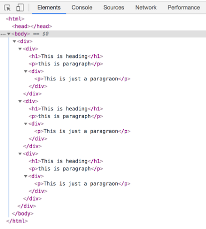

# react


## react与angular有什么不同

angular是一个成熟的MVC框架，带有很多特定的特性，比如服务，指令，模板，模块，解析器等等。
react是一个非诚轻量级的库，它只关注MVC的视图部分

angular遵循两个方向的数据流，而react遵循从上到下的单向数据流。

react在开发特性时给开发人员很大的自由：如：调用API的方式，路由等等。我们不需要包括路优酷，除非我们需要它在我们的项目

## 什么是Virtual DOM及其工作原理

### Virtual DOM

浏览器遵循HTML指令来构造文档对象模型DOM。当浏览器加载HTML并呈现用户界面时，HTML文档中的所有元素都变成DOM元素

DOM是从根元素开始的元素层次结构
```
    <div>
        <p></p>
        ...
    </div>
```
当浏览器中加载这个HTML时，所有这些HTML元素都被转换成DOM元素



当涉及到SPA应用程序时，首次加载index.html，并在index.html本身中加载更新后的数据或另一个html。当用户浏览站点时，我们使用新的内容更新相同的index.html。每当DOM发生更改时，浏览器都需要重新计算CSS、进行布局并重新绘制web页面

react使用Virtual DOM有效的重建DOM。对于我们来说，这使得DOM操作这一项非常复杂和耗时的任务变得更加容易。react从开发者那里抽象出所有这些，以便在Virtual DOM的帮助下构建高效的UI

### Virtual DOM工作原理
虚拟DOM只不过是真实DOM的javascript对象表示。与更新真实的DOM相比，更新javascript对象更容易，更快捷。

- react将整个DOM副本保存为虚拟DOM

- 当有更新时，它都会维护两个虚拟DOM，比较之前的状态和当前的状态，并确定哪些对象已经被更新。

- 通过比较两个虚拟DOM得出的差异，并将这些变化更新到实际DOM

- 一旦真正的DOM更新，它也会更新UI

## 什么是jsx
JSX是javascript的语法扩展。它就像一个拥有javascript全部功能的模板语言。

## 组件的不同类型

### 1.函数/无状态/展示组件
函数或无状态组件是一个村函数，它可以接受参数，并返回react元素。这些都是没有任何副作用的纯函数。

这些组件没有状态鸥生命周期方法

函数组件/无状态组件
```
    import React from 'react';
    import Jumbotron from 'react-bootstrap/Jumbotron';

    export const Header = () => {
        return(
            <Jumbotron style={{backgroundColor:'orange'}}>
                <h1>TODO App</h1>
            </Jumbotron>
        )
    }

```

### 2.类/有状态组件

类或有状态组件具有状态和生命周期方法，可以通过setState()方法改变组件的状态。类组件时通过扩展react创建的。它在构造函数中初始化，也可能有子组件


### 3.受控组件

受控组件时在react中处理输入表单的一种技术。表单元素通常维护它们自己的状态，而react则在组件的状态属性中维护状态。这成为受控组件。因此，在受控组件表单中，数据由ract组件处理


### 4.非受控组件

大多数情况下，建议使用受控组件。有一种被称为非受控组件的方法可以通过```React.createRef()```定义Ref并传递该输入表单并直接从handleSubmit方法中的DOM访问表单值

### 5. 容器组件
容器组件时处理获取数据，订阅redux存储等的组件，他们包含展示组件和其他容器组件，**但是里面从来没有html**

### 5. 高阶组件

高阶组件是将组件作为参数并生成另一个组件的组件。redux connect是高阶组件的示例。

这是一种生成重用组件的强大技术


## Props和state

 // ...

## 什么是PropTypes

PropTypes为组件提供类型检

如果组件没有接收到任何props,我们还可以为每个组件定义要显示的props.


## 如何更新状态以及如何不更新

你不应该直接修改状态。可以在构造函数中定义状态值。直接使用状态不会触发重新渲染。React使用this.setState()合并状态

```
    // 根据props更新状态
    this.setState((state, props) => {
        timesVisited: state.timesVisited + props.count
    })
```

## 组件生命周期方法

- componentWillMount(): 在渲染前调用，只发生一次。（在客户端也在服务端）
- componentDidMount(): 在第一次渲染后调用，只在客户端。之后组件已经生成了对应的DOM结构，可以通过this.getDOMNode()来访问。
- componentWillReceiveProps(): 在组件接收到一个新的prop（更新后）时被调用。这个方法在初始化render时不会被调用
- shouldComponentUpdate():
    1. 返回一个布尔值。在组件接收到新的props或者state时被调用。
    2. **在初始化时**或者**使用forceUpdate时****不会调用**。
    3. 可以在你确认不需要更新组件时使用

- componentDidUpdate(): 在组件完成更新够立即调用。在初始化是不会被调用
- componentWillUnMount(): 组件从DOM中移除的时候立即被调用

#### ErrorBoundary

当渲染过程中，声明周期，或子组件的构造函数中抛出错误时，会调用：
- getDerivedStateFromError(): 
    1. 这个生命周期方法在ErrorBoundary类中使用。实际上，如果使用这个生命周期方法，任何类都会变成ErrorBoundary.这用于在组件树中出现错误是呈现回退UI,而不是在屏幕上显示一些奇怪的错误
- componentDidCatch(): 在ErrorBoundary类中使用。实际上，如果这个生命周期方法，任何类都会变成ErrorBoundary。这用于在组件树出错是记录错误 

##### getDerivedStateFromError
在此声明周期会在后代组件抛出错误后被调用。它将抛出错误作为参数，并返回一个值以更新state
```

```

##### componentDidCatch()
```
public componentDidCatch(error: any, info: any) {
    console.log('componentDidCatch:', error, info)
    this.setState({
      hasError: error,
      errorInfo: info
    })
  }
```

## 超越继承的组合
在react中，我们总是使用组合而不是继承。我们已经在函数式编程部分讨论了什么是组合。这是一种结合简单的可重用函数来生成高阶组件的技术。

以下是一个组合的而例子
```
    import { TodoForm } from './todoForm'
    import { TodoList } from './todoList'
    class class Dashboard extends Component{
        render(){
            return (
                <div>
                    <TodoForm/>
                    <TodoList/>
                </div>
            )
        }
    }
```

## 如何在react中应用样式

- 外部样式表
```import './index.css'```
- 内联样式
``` <div style={{color: '#fff'}} /> ```

## 边界错误
在react中，我们通常有一个组件树。如果任何一个组件发生错误，它将破坏整个组件树。没有办法捕获这些错误，我们可以用错误边界优雅地处理这些错误

错误边界的作用
- 发生错误，显示回退UI
- 记录错误

## Fragments
使用Fragments,我们可以不需要再DOM中添加额外的节点
```
<>
    ...
</>
```
## 什么是传送门Portals

默认情况下，所有子组件都在UI上呈现，具体取决于组件层次结构。Portal提供了一种将子节点渲染到存在于父组件意外的DOM节点的优秀方案

```

```

## 什么是上下文

有时候我们必须将props传递给组件树，即使所有中间组件都不需要这些props.上下文是一种传递props的方法，而不用在每一层传递组件树