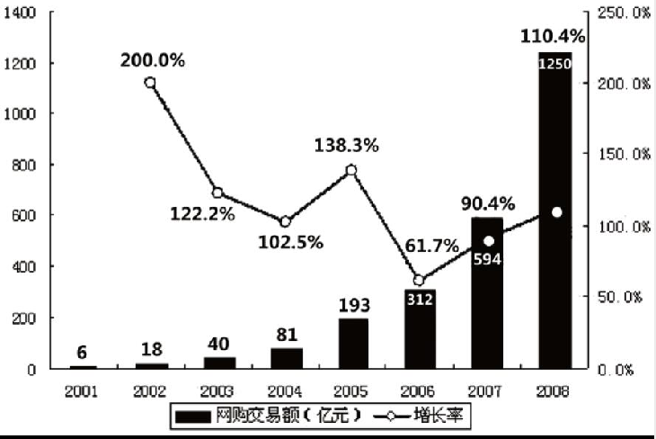

The column chart above illustrates the turnover of online shopping and its growth rate in China from 2001 to 2008. During the period, there was a dramatic increase from 0.6 billion in 2001 to 125 billion in 2008 in the turnover. Meanwhile, the growth rate decreased from 200% to 110.4%, a decline of about 90 percentage points.While online shopping is not without its risks, it offers people an excellent alternative to the traditional way of shopping. The first reason that e-shopping is so appealing is its relative ease and convenience. For conscientious students with hectic schedules, purchasing items on Taobao.com among other websites is an excellent way to free up valuable time for their studies. The second advantage of online shopping is that it is available 24/7. Being able to shop at any and all hours of the day is conducive to the late nights associated with the modern lifestyle; at the same time, it means that people no longer have to plan their activities around stores' opening hours.Despite the advantages to people making purchases online, there are also a few caveats that young people should bear in mind. Firstly, the speediness and convenience of e-shopping may encourage frivolous or unnecessary spending by inducing people to buy more than they had initially intended. Secondly, there is a chance that those who are already introverted may become even more alienated from the outside world.

column chart 柱状图
illustrate 阐明
growth rate 增长率
during the period 在此期间
dramatic 急剧的
without its risk 零风险
alternative 供替代的选择
e-shopping 网上购物
appealing 吸引人的
ease 容易
convenience 方便
conscientious 认真的
hectic 繁忙的
schedule 日程，时间表
purchase 购买
item 物品
free up 节省
available 可获得的
be conducive to 对……有好处
late nights 晚睡
modern lifestyle 现代生活方式
opening hour 营业时间
make purchase 购物
caveat 忠告
bear...in mind 记在心上
frivolous 草率的
induce 诱导
initially 最初
introverted 内向的
alienated 疏远的

① The first and perhaps the biggest draw of e-shopping is that it allows students to find the cheapest possible price at the click of a button. 网购的第一个可能也是最大的诱人之处在于它可以使学生们只要点击按钮就可以找到可能最便宜的价格。
②Since the 1990s, however, young people in mounting numbers have turned to the net to acquire a range of student essentials from reference books and writing utensils to clothing and electronics. 然而自从20 世纪90 年代开始，越来越多的年轻人开始在网上购买一系列的学生必需品——从参考书、文具到衣服和电子产品。
③If taken to an extreme, online shopping may cause shy or reserved students to live even more reclusive lifestyles, to the detriment of both their social and physical well-being. 更极端地说，网上购物也许会让害羞或矜持的学生以更加封闭的方式生活，这对他们的人际交往与身体健康都有害处。

